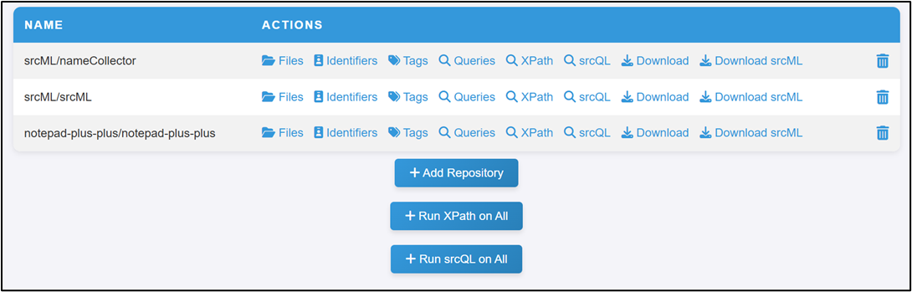

# srcView
 - A web-based tool that automates the download and processing of code from user-specified GitHub projects by leveraging the srcML Infrastructure to facilitate the analysis of GitHub repositories

 - srcView employs various analysis tools, including Stereocode, srcQL, nameCollector, and nameChecker, to thoroughly examine the codebase
 
 - The tool categorizes the generated data into Files, Identifiers, Tags, XPath, and srcQL
 
 - Additionally, srcView provides a Download option to allow users to access the processed data locally
 
 - srcView is expected to streamline the process of analyzing large codebases by providing researchers with valuable insights into software design and development practices

# Running
- srcView can be deployed using flask:
```bash
flask run
```

# Overview


# Team
- Ali Al-Ramadan
- Syreen Banabilah
- Joshua Behler
